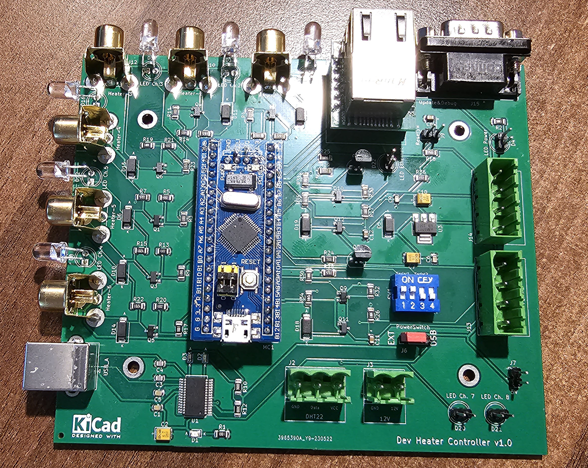

# DewController
 **Device to control the dew heaters and fans on astronomic instruments**
 
 Dew is an obvious nuisance for astronomic instruments and a simple way of getting rid of it are heaters places on elements of the optical chain susceptible to forming dew.

The the described device is a 6 channel heater driver, and a 2 channel fan driver, as some reflecting telescopes have a fan installed on the back of the main mirror.

The heaters and fans are driven by PWM signals software controlled by means of a STM32F103 microcontroller. The connection with the computer can be achieved either through USB or Ethernet (TCP/IP) or both.

The device also has a DHT22 temperature & humidity sensor, so the dew point can be computed to get an indication of whether the heaters have to be powered and how much power has to be supplied to the heaters.

# Description

1.  - Heater 1 (connector and LED)
2.  - Heater 2 (connector and LED)
3.  - Heater 3 (connector and LED)
4.  - Heater 4 (connector and LED)
5.  - Heater 5 (connector and LED)
6.  - Heater 6 (connector and LED)
7.  - USB connector
8.  - Ethernet Connector
9.  - Connector for servicing - 9 pin
10.  - Fan 1 (connector and LED)
11.  - Fan 2 (connector and LED)
12. - DHT 22 sensor
13. - 12V power connector
14. - Reset button
15. - Bracket for mounting the device on the telescope
